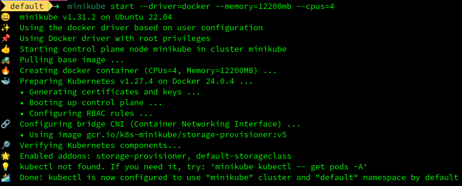
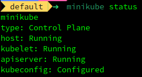
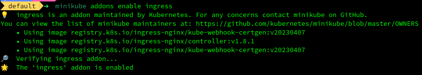
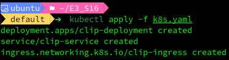
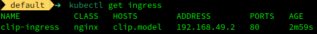
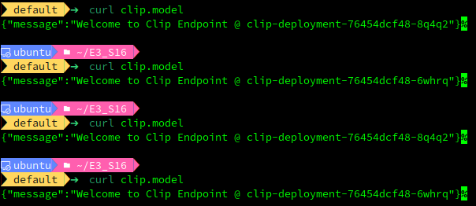
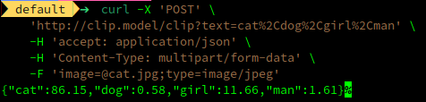

<div align="center">

# Deploying CLIP on Minikube

</div>

In this repository, we deploy a docker image that contains a FastAPI backend to run a prediction via the CLIP model against a string (which is a list of classes) and an image on Kubernetes (running on EC2). The service is exposed via an Ingress. 

# Installation
```bash
curl -LO https://storage.googleapis.com/minikube/releases/latest/minikube-linux-amd64
sudo install minikube-linux-amd64 /usr/local/bin/minikube
```


#  Setup Minikube

```bash
minikube start --driver=docker --memory=12200mb --cpus=4
```
  

```
minikube status
```
   

```minikube addons enable ingress
minikube addons enable dashboard
minikube addons enable metrics-server
```

   


# Containerize App

```bash
# to build docker image
docker build -t clip .
minikube image load clip:latest

# to verify
minikube image ls
```


# Create Deployment/Service/Ingress

The YAML file is located [here](./files/k8s.yaml)

```bash
kubectl apply -f k8s.yaml
```

  

  
# Accessing Ingress

## Option 1 - use minikube ip

```bash
echo "$(minikube ip) clip.model" | sudo tee -a /etc/hosts
curl clip.model
```

  

## Option 2 - use localhost

```bash
# in one terminal
kubectl port-forward -n ingress-nginx svc/ingress-nginx-controller 8080:80 

# in other terminal
echo "127.0.0.1 clip.model" | sudo tee -a /etc/hosts
curl clip.model:8080
```

Similarly all other paths - `/` , `/health` , and `/docs` can be accessed via the curl commands.


# Running Inference

```bash
curl -X 'POST' \
    'http://clip.model/clip?text=cat%2Cdog%2Cgirl%2Cman' \
    -H 'accept: application/json' \
    -H 'Content-Type: multipart/form-data' \
    -F 'image=@cat.jpg;type=image/jpeg'
```

   

# Logs


[kubectl describe deployment clip-deployment](./files/q1.md)

[kubectl describe pod clip-deployment-76454dcf48-48s9r](./files/q2.md)

[kubectl describe ingress clip-ingress](./files/q3.md)

[kubectl top pod](./files/q4.md)

[kubectl top node](./files/q5.md)

[kubectl get all -A  -o yaml](./files/q6.md)
